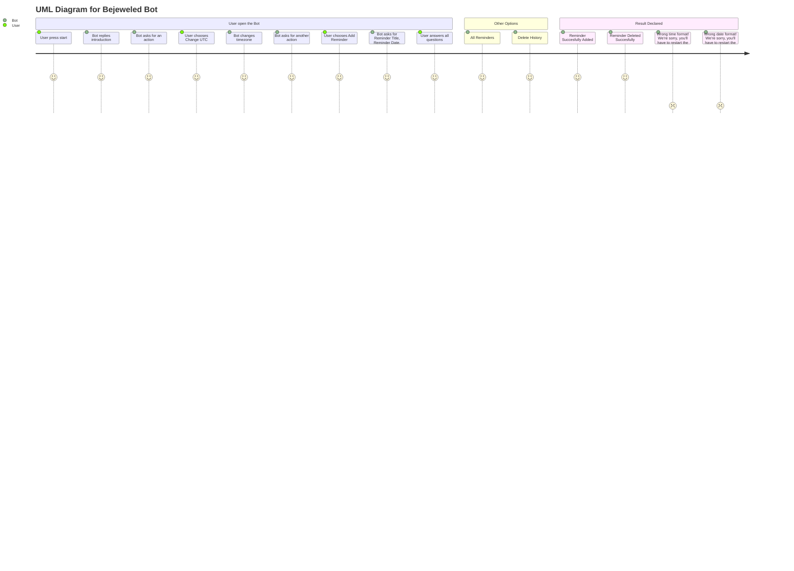

# TELEGRAM REMINDER BOT

### FEATURES OF TELEGRAM REMINDER BOT

  What can this Telegram Bot do?
  1. Remind a user of event with specific time and date.
  2. Make a conversation with a user to add reminders.
  3. Save a user reminder history.
  4. Let a user delete a reminder from history.

### In this version
  1. Install the required modules.
  2. Create a Bot on Telegram and gets it's API Token.
  3. Setting up the main functions. 
  4. Create our Main Menu and variables.
  5. Create functions to save the data.
  6. Handle messages and conversations with the telegram Bot using Python.
  7. Telling the bot what functions to use
  8. Run the BOT!

### Required Modules/Dependencies
  1. Python-Telegram-Module
  2. Pip.
  3. Python-dotenv

